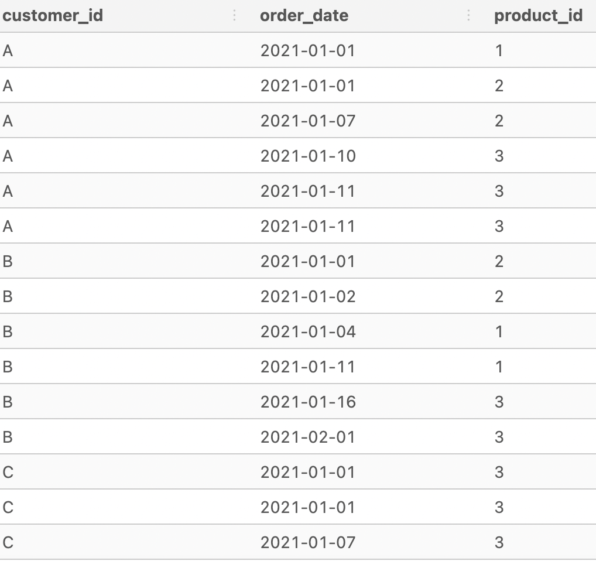

 <h1 align="left">Case Study #1: Danny's Diner</h1>

  

## Problem Statement
Danny wants to use the data to answer questions about his customers, especially about their visting patterns, how much money they've spent and also which items are their favorite. Daniel feels that this information will help him deliver a better and more personalized experience for his customers.  Danny also plans to use these insights to help decide whether he should expand the customer loyalty program.  Danny has asked me to write SQL queries to answer the questions.
Danny was provided me with 3 datasets: sales, menu, members.

## Dataset
Danny has provided us with 3 datasets for this case study: sales, menu, members.

### sales
This dataset includes all the customer_id purchases, the corresponding order_date and the product id of each purchase.

  

### menu
This dataset includes the product_id for each item on the menu, the product_name of each item and the corresponding price.

  

### members
This dataset concerns the customer loyalty program and includes the customer_id of members and their join_date.

  

## Entity Relationship Diagram 

  

## Case Study Questions
1. What is the total amount each customer spent at the restaurant?  
2. How many days has each customer visited the restaurant? 
3. What was the first item from the menu purchased by each customer?  
4. What is the most purchased item on the menu and how many times was it purchased by all customers?
5. Which item was the most popular for each customer?
6. Which item was purchased first by the customer after they became a member?
7. Which item was purchased just before the customer became a member?
8. What is the total items and amount spent for each member before they became a member?
9. If each $ spent equates to 10 points and sushi has a 2x points multiplier - how many points would each customer have?
10.In the first week after a customer joins the program (including their join date) they earn 2x points on all items, not just sushi - how many points do customer A and B have at the end of January?  

## Solutions
[Case Study #1: Solutions](https://github.com/davidrtorres/8-Week-SQL-Challenge/blob/main/Case%20Study%20%231-%20Danny's%20Diner/Solutions.md)
       

