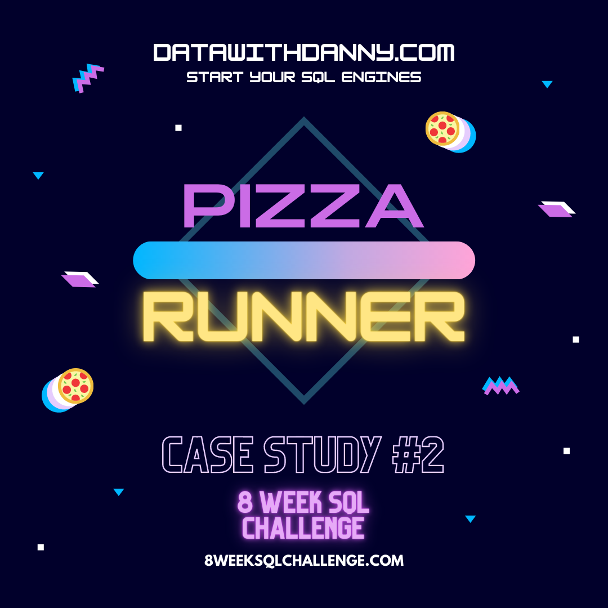
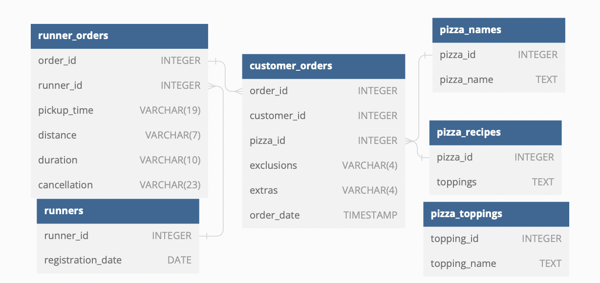

# Case Study #2 - Pizza Runner

  

### Business Task

Danny is looking to expand his Pizza Empire.  Danny knows that pizza alone isn't going to help him get seed funding.  Danny had the idea to Uberize it and so Pizza Runner was launched!

Danny started by recruiting “runners” to deliver fresh pizza from Pizza Runner Headquarters (otherwise known as Danny’s house).  Danny maxed out his credit card to pay freelance developers to build a mobile app to accept orders from customers.

### Entity Relationship Diagram

  

This questions for this case study focus on the following areas: 
* Pizza Metrics
* Runner and Customer Experience
* Ingredient Optimisation
* Pricing and Ratings
* Bonus DML Challenges (DML = Data Manipulation Language)

