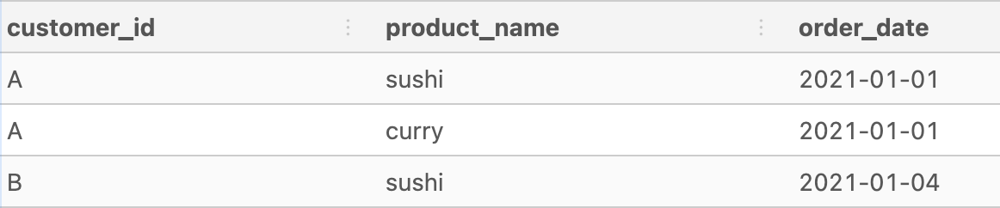

# Solutions


I created a temporary table to join the sales and menu tables.
```
DROP TABLE IF EXISTS dannys_diner_complete;
CREATE TEMP TABLE dannys_diner_complete AS
SELECT
  s.customer_id AS customer_id,
  s.order_date AS order_date,
  m.product_name AS product_name,
  m.price AS price
FROM dannys_diner.sales AS s
INNER JOIN dannys_diner.menu AS m
ON s.product_id = m.product_id;

SELECT * FROM dannys_diner_complete;
```
Output
<p align="center">
  
</p>

### 1. What is the total amount each customer spent at the restaurant?

```
SELECT
  customer_id,
  SUM(price)
FROM dannys_diner_complete
GROUP BY customer_id
ORDER BY customer_id;
```
Output
<p align="left">
  
</p>

### 2. How many days has each customer visited the restaurant?
```
SELECT
  customer_id,
  COUNT(DISTINCT order_date) 
FROM dannys_diner_complete
GROUP BY customer_id
ORDER BY customer_id;
```
Output
<p align="left">
  
</p>

### 3. What was the first item from the menu purchased by each customer?
```
WITH cte_first_purchase AS (
SELECT
  customer_id, 
  product_name,  
  order_date,
  ROW_NUMBER() OVER(
    PARTITION BY customer_id ORDER BY order_date) category_ranking
FROM dannys_diner_complete
)
SELECT
  customer_id,
  product_name,
  ROW_NUMBER() OVER(
    PARTITION BY customer_id ORDER BY order_date) category_ranking
FROM cte_first_purchase  
WHERE category_ranking =1
```
Output
<p align="left">
  
</p>

### 4. What is the most purchased item on the menu and how many times was it purchased by all customers?
```
SELECT
  product_name,
  COUNT(*) AS item_purchased_count
FROM dannys_diner_complete
GROUP BY product_name
ORDER BY item_purchased_count DESC;
```
Output
<p align="left">
  
</p>

### 5. Which item was the most popular for each customer?
```
WITH cte_popular_item AS (
SELECT
  customer_id,
  product_name,
  COUNT(*) AS times_purchased,
  ROW_NUMBER() OVER(
    PARTITION BY customer_id ORDER BY COUNT(product_name) DESC) category_ranking
FROM dannys_diner_complete
GROUP BY customer_id, product_name
)
SELECT
  customer_id,
  product_name,
  times_purchased
FROM cte_popular_item
WHERE category_ranking = 1


```
Output
<p align="left">
  
</p>

### 6. Which item was purchased first by the customer after they became a member?
```
DROP TABLE IF EXISTS membership_purchase;
CREATE TEMP TABLE membership_purchase AS (
SELECT
  s.customer_id AS customer_id,
  s.order_date AS order_date,
  m.product_name AS product_name,
  me.join_date AS join_date,
  CASE
  WHEN s.order_date >= join_date 
    THEN 'X'
  ELSE ''  
  END AS membership
FROM dannys_diner.sales AS s
JOIN dannys_diner.menu AS m
ON s.product_id = m.product_id
JOIN dannys_diner.members AS me
ON s.customer_id = me.customer_id
ORDER BY s.customer_id
);
WITH cte_purchase_membership AS (
SELECT
  customer_id,
  product_name,
  order_date,
  RANK() OVER(
    PARTITION BY customer_id ORDER BY order_date) AS purchase_after_join
FROM  membership_purchase
WHERE membership = 'X'
)
SELECT
*
FROM cte_purchase_membership
WHERE purchase_after_join =1;

```
Output
<p align="left">
  
</p>

### 7. Which item was purchased just before the customer became a member?
```
DROP TABLE IF EXISTS purchase_before_member;
CREATE TEMP TABLE purchase_before_member AS (
SELECT
  s.customer_id AS customer_id,
  s.order_date AS order_date,
  m.product_name AS product_name,
  me.join_date AS join_date,
  CASE
  WHEN s.order_date < join_date 
    THEN 'X'
  ELSE ''  
  END AS membership
FROM dannys_diner.sales AS s
JOIN dannys_diner.menu AS m
ON s.product_id = m.product_id
JOIN dannys_diner.members AS me
ON s.customer_id = me.customer_id
ORDER BY s.customer_id
);
SELECT * FROM purchase_before_member

WITH cte_purchase_before_member AS (
SELECT
  customer_id,
  product_name,
  order_date,
  RANK() OVER(
    PARTITION BY customer_id ORDER BY order_date DESC) AS purchase
FROM purchase_before_member
WHERE membership = 'X'
)
SELECT
  customer_id,
  product_name,
  order_date
FROM cte_purchase_before_member
WHERE purchase = 1;
```
Output
<p align="left">
  
</p>

### 8. What is the total items and amount spent for each member before they became a member?
```
DROP TABLE IF EXISTS purchase_member;
CREATE TEMP TABLE purchase_member AS (
SELECT
  s.customer_id AS customer_id,
  s.order_date AS order_date,
  m.product_name AS product_name,
  me.join_date AS join_date,
  m.price AS price,
  CASE
  WHEN s.order_date >= join_date 
    THEN 'X'
  ELSE ''  
  END AS membership
FROM dannys_diner.sales AS s
JOIN dannys_diner.menu AS m
ON s.product_id = m.product_id
JOIN dannys_diner.members AS me
ON s.customer_id = me.customer_id
ORDER BY s.customer_id
);

WITH cte_purchase_member AS (
SELECT
  customer_id,
  price
FROM purchase_member
WHERE membership= ''
)
SELECT
  customer_id,
  SUM(price) AS total_spent,
  COUNT(*) AS total_items
FROM cte_purchase_member
GROUP BY customer_id;

```
Output
<p align="left">
  
</p>
