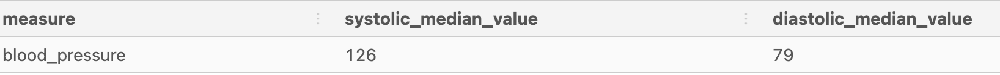

# Health Analytics Case Study


For Questions 2-7 I created a temporary table.  The output concerns the columns id and measure.  The measure feature has 3 categories: blood_pressure, blood_glucose and weight.  The ouput shows the unique ids, the measure count for each id and the unique measure count for each id (how many measure categories did user use).
```
DROP TABLE IF EXISTS user_measure_count;

CREATE TEMP TABLE user_measure_count AS (
SELECT
  id,
  COUNT(*) AS measure_count,
  COUNT(DISTINCT measure) AS unique_measure_count
FROM health.user_logs 
GROUP BY id);
```
Output


------
#### Question 1: How many unique users exist in the logs dataset?
There are 554 unique users in the user_logs table.
```
SELECT
  COUNT(DISTINCT id)
FROM user_measure_count;  
```
#### Question 2: How many total measurements do we have per user on averge?
There are an average of 79.23 measurements per user
```
SELECT
  ROUND(AVG(measure_count),2) AS average_value
FROM user_measure_count
```
#### Question 3: What is the median number of the total measurements per user?
The median number is 2.
```
SELECT
  PERCENTILE_CONT(0.5) WITHIN GROUP (ORDER BY measure_count) AS median_value
FROM user_measure_count;

```
-------
#### Question 4: How many users have 3 or more measurements?
209 users have 3 or more measurements.
```
SELECT
  COUNT(*) AS users_3_or_more
FROM user_measure_count 
WHERE measure_count >= 3;
```
-----
#### Question 5: How many users have 1000 or more measurements?
5 users have 5 or more measurements.
```
SELECT
  COUNT(DISTINCT id) 
FROM user_measure_count 
WHERE measure_count > 1000 

```
-------
#### Question 6: How many users and the percentage have logged blood glucose measurements?
There are 325 users which is 40.22% of users that have logged blood glucose measurements.
```
WITH my_sample AS (
SELECT
  measure,
  COUNT(DISTINCT id) AS freq,
  ROUND(100 * COUNT(DISTINCT id)::NUMERIC / SUM(COUNT(DISTINCT id)) OVER (),2) AS percentage
FROM health.user_logs
GROUP BY measure
)
SELECT
  *
FROM my_sample
WHERE measure = 'blood_glucose'
```
----------
#### Question 7: How many users have logged at least 2 types measurements?
Out of 554 users 204 have logged at least 2 types of measurements.
```
SELECT
  COUNT(*)
FROM user_measure_count
WHERE unique_measure_count >= 2
```
-------
#### Question 8: How many users have logged all 3 measurements - blood glucose, weight and blood pressure?
Out of 554 users 50 have logged all 3 measurements.
```
SELECT 
  COUNT(id)
FROM user_measure_count
WHERE unique_measure_count = 3;
```
-------
#### Question 9: What are the median systolic/diastolic blood pressure values?
vbv
```
SELECT
  measure,
  PERCENTILE_CONT(0.5) WITHIN GROUP (ORDER BY systolic) AS systolic_median_value,
  PERCENTILE_CONT(0.5) WITHIN GROUP (ORDER BY diastolic) AS diastolic_median_value
FROM health.user_logs
WHERE measure = 'blood_pressure'
GROUP BY measure; 
```
Output<br>

c
-----
