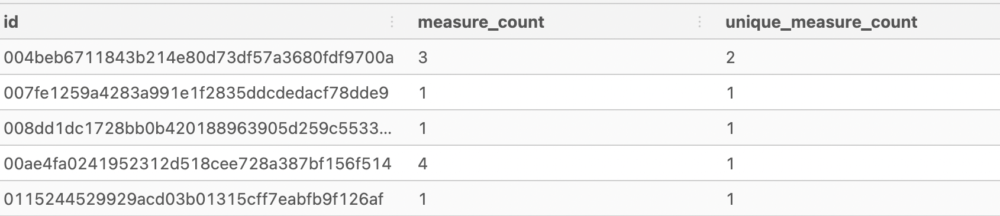

# Health Analytics Case Study


For Questions 2-7 I created a temporary table.  The output concerns the columns id and measure.  The measure feature has 3 categories: blood_pressure, blood_glucose and weight.  The ouput shows the unique ids, the measure count for each id and the unique measure count for each id (how many measure categories did user use).
```
DROP TABLE IF EXISTS user_measure_count;

CREATE TEMP TABLE user_measure_count AS (
SELECT
  id,
  COUNT(*) AS measure_count,
  COUNT(DISTINCT measure) AS unique_measure_count
FROM health.user_logs 
GROUP BY id);
```
Output



------
#### Question 1: How many unique users exist in the logs dataset?
There are 554 unique users in the user_logs table.
```
SELECT
  COUNT(DISTINCT id)
FROM user_measure_count;  
```
