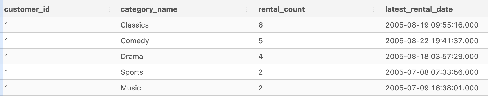
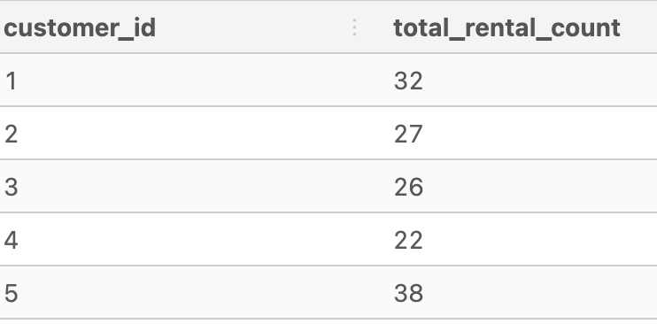
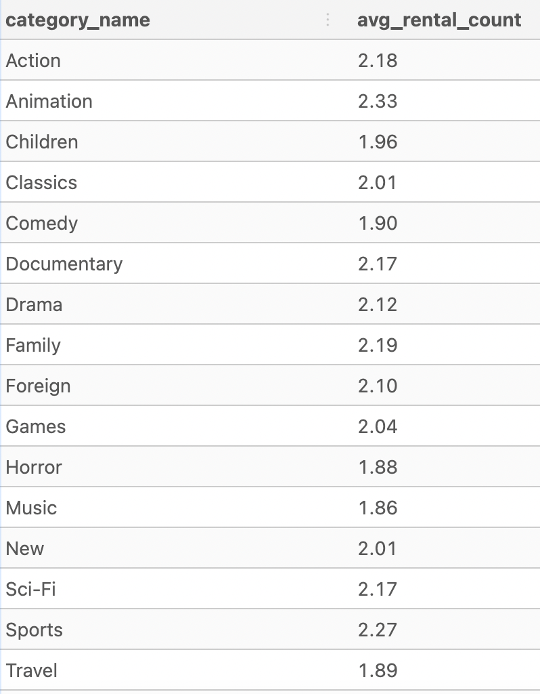
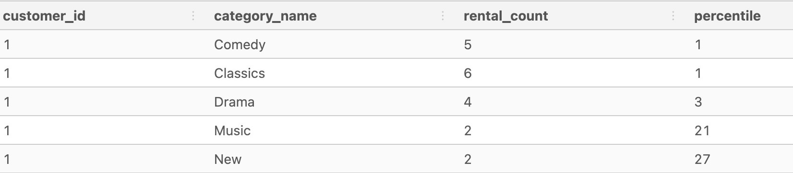

# Data Analysis

I'm working with several tables which need to be joined.  Here is the code using INNER JOIN to join the 5 tables.
```
DROP TABLE IF EXISTS complete_joint_dataset;
CREATE TEMP TABLE complete_joint_dataset AS
SELECT
  rental.customer_id,
  inventory.film_id,
  film.title,
  rental.rental_date,
  category.name AS category_name
FROM dvd_rentals.rental
INNER JOIN dvd_rentals.inventory
  ON rental.inventory_id = inventory.inventory_id
INNER JOIN dvd_rentals.film
  ON inventory.film_id = film.film_id
INNER JOIN dvd_rentals.film_category
  ON film.film_id = film_category.film_id
INNER JOIN dvd_rentals.category
  ON film_category.category_id = category.category_id;

SELECT * FROM complete_joint_dataset limit 5;
```
Output


-------
<br>
<br>

### What was the total rental count for customer_id=1 for each category?  
For screen purposes I limited the output to the top 5 catgories.  We can see that for customer_id=1 the top 5 categories were Classics, Comedy, Drama, Sports and Action.  Classics was the largest with 6 rentals.  I also included the MAX() function which is used as a sort valuyes which are of equal value.  In this case both Sports and Action have a value of 2, with MAX() we are able to see which rental_date is the more recent value.  
```
DROP TABLE IF EXISTS category_rental_counts;
CREATE TEMP TABLE category_rental_counts AS
SELECT
  customer_id,
  category_name,
  COUNT(*) AS rental_count,
  MAX(rental_date) AS latest_rental_date
FROM complete_joint_dataset
GROUP BY customer_id,
         category_name;

SELECT 
  *
FROM category_rental_counts
ORDER BY customer_id, rental_count DESC
LIMIT 5;
```
Output


-----

### What is the total rental count for customer ids 1 - 5?
```
DROP TABLE IF EXISTS category_rental_counts;
CREATE TEMP TABLE category_rental_counts AS
SELECT
  customer_id,
  category_name,
  COUNT(*) AS rental_count,
  MAX(rental_date) AS latest_rental_date
FROM complete_joint_dataset
GROUP BY customer_id,
         category_name;

DROP TABLE IF EXISTS customer_total_rentals;
CREATE TEMP TABLE customer_total_rentals AS
SELECT
  customer_id,
  SUM(rental_count) AS total_rental_count
FROM category_rental_counts
GROUP BY customer_id

SELECT 
  *
FROM customer_total_rentals
WHERE customer_id <=5
ORDER BY customer_id;

```
Output<br>



--------
### What is the average rental count for each category?
```
DROP TABLE IF EXISTS average_category_rental_counts;
CREATE TEMP TABLE average_category_rental_counts AS
SELECT
  customer_id,
  category_name,
  COUNT(*) AS rental_count
FROM complete_joint_dataset
GROUP BY customer_id, category_name;

SELECT
  category_name,
  ROUND(AVG(rental_count),2) AS avg_rental_count
FROM average_category_rental_counts
GROUP BY category_name
ORDER BY category_name;
```
Output<br>


-----
### What is percentile value for customer 1 when compared to other customers?
```
DROP TABLE IF EXISTS category_rental_counts;
CREATE TEMP TABLE category_rental_counts AS
SELECT
  customer_id,
  category_name,
  COUNT(*) AS rental_count,
  MAX(rental_date) AS latest_rental_date
FROM complete_joint_dataset
GROUP BY customer_id,
         category_name;

DROP TABLE IF EXISTS customer_category_percentiles;
CREATE TEMP TABLE customer_category_percentiles AS
SELECT 
  customer_id,
  category_name,
  rental_count,
  -- use ceiling to round up to nearest integer after multiplying by 100
  CEILING(
  100 * PERCENT_RANK() OVER (
    PARTITION BY category_name
    ORDER BY rental_count DESC
    )
  ) AS percentile
FROM category_rental_counts;

SELECT
  *
FROM customer_category_percentiles
WHERE customer_id =1
ORDER BY customer_id, percentile
LIMIT 5;

```
Output

