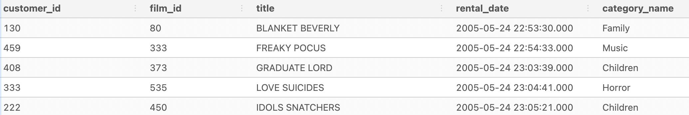

# Data Analysis

I'm working with several tables which need to be joined.  Here is the code using INNER JOIN to join the 5 tables.
```
DROP TABLE IF EXISTS complete_joint_dataset;
CREATE TEMP TABLE complete_joint_dataset AS
SELECT
  rental.customer_id,
  inventory.film_id,
  film.title,
  rental.rental_date,
  category.name AS category_name
FROM dvd_rentals.rental
INNER JOIN dvd_rentals.inventory
  ON rental.inventory_id = inventory.inventory_id
INNER JOIN dvd_rentals.film
  ON inventory.film_id = film.film_id
INNER JOIN dvd_rentals.film_category
  ON film.film_id = film_category.film_id
INNER JOIN dvd_rentals.category
  ON film_category.category_id = category.category_id;

SELECT * FROM complete_joint_dataset limit 5;
```
Output

-------
<br>
<br>

What is the total rental count for customer_id=1 for each category.  I will limited the output for the top 5. 
```
DROP TABLE IF EXISTS category_rental_counts;
CREATE TEMP TABLE category_rental_counts AS
SELECT
  customer_id,
  category_name,
  COUNT(*) AS rental_count,
  MAX(rental_date) AS latest_rental_date
FROM complete_joint_dataset
GROUP BY customer_id,
         category_name;

SELECT 
  *
FROM category_rental_counts
ORDER BY customer_id, rental_count DESC
LIMIT 5;
```
Output
